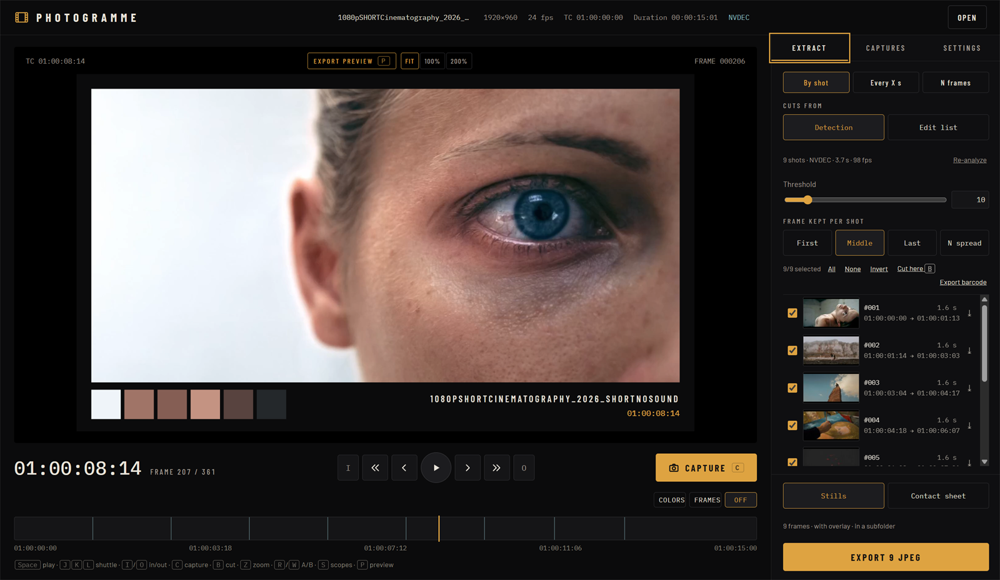
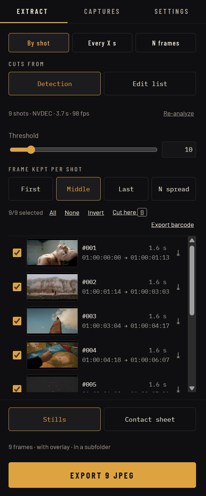
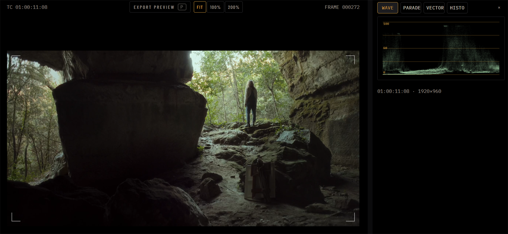
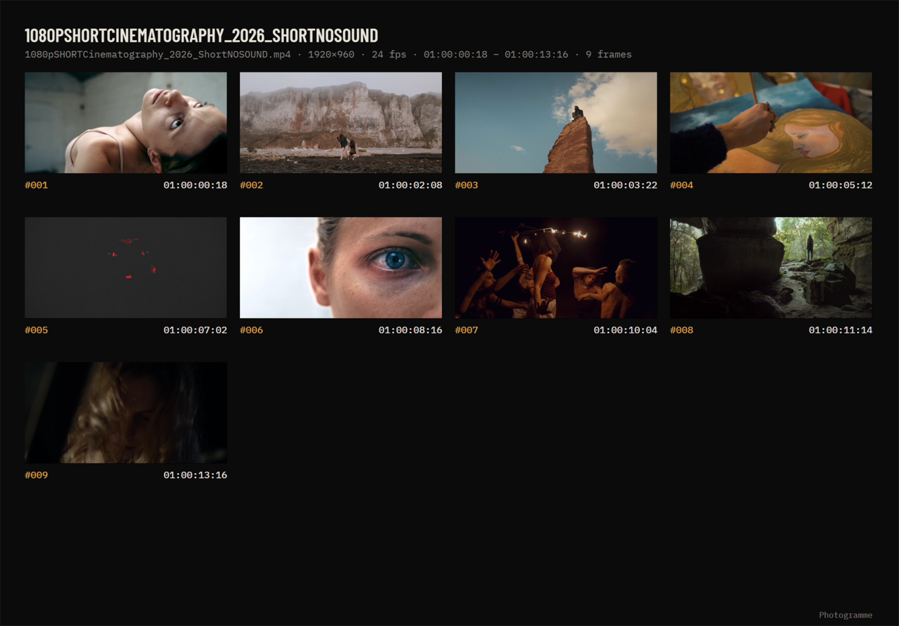
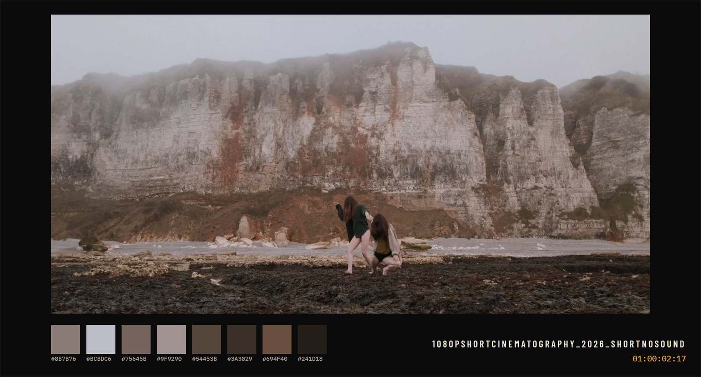

<!-- Hand-written page: scripts\publish-public.ps1 leaves it alone while this line is here. -->
<div align="center">

# Photogramme

**Pull clean stills out of finished films.**<br>
Built out of pure laziness. Then it got a bit out of hand.

[](https://github.com/ArnGui/photogramme/releases/latest)

[](LICENSE)

[**Download for Windows**](https://github.com/ArnGui/photogramme/releases/latest) · [Guide en français](docs/GUIDE-FR.md) · [Report a bug](https://github.com/ArnGui/photogramme/issues)

</div>

> [!NOTE]
> **This page is ADHD-friendly.** The useful part comes first, sections are short, and the long stuff is folded away. Read the first screen and you know whether this tool is for you. Everything below the line is optional.

> [!IMPORTANT]
> **Version 0.5: hopefully stable, certainly not final.** It is tested on real films and used in my own work, but it is one person's software, so expect fixes and new features. You won't have to watch this page: when an update is out, Photogramme offers it at startup and installs it in one click.



## TL;DR

- **What:** a free Windows app that turns a finished H.264 film into stills, contact sheets and color palettes.
- **How:** open the film, let it find the cuts (or import your EDL / XML), press Export.
- **Why:** because scrubbing a 90-minute film to screenshot 400 shots by hand in VLC or Resolve is a pain in the a**, and other software doesn't do exactly what I wanted.

## Who it's for

| You are… | Your problem | What Photogramme does |
|---|---|---|
| **Filmmaker / editor** | Festivals, press kits and distributors want stills. Your NLE gives you one frame at a time, named `Untitled_0042.png`. | One still per shot of the whole film, named after the master's timecode and clip name, at full resolution, with anamorphic and rotated footage displayed correctly. |
| **Colorist / DP** | You need references, palettes and a look at the signal, not a vague JPEG that looks different in every app. | Waveform, parade, vectorscope and histogram on the exact exported pixels, A/B wipe, honest color management (Rec.709 / BT.1886 or sRGB, with the ICC profile embedded), palettes in the CIELAB color space exported to Adobe, CSS, GIMP or JSON. |
| **Producer / client** | You want to *see* the film without watching it, approve it, annotate it, print it. | Printable contact sheets (PDF, A4/A3/Letter/Tabloid) with timecodes, shot numbers and clip names. Something you can actually circle with a red pen. |

## Headline features

- **One still per shot.** Automatic cut detection, or exact cuts from your EDL, OTIO, FCP7 XML or FCPXML (Resolve, Premiere, Final Cut).
- **Real timecode.** Files are named after the film's own timecode: masters starting at `01:00:00:00` and 29.97 drop-frame included.
- **Contact sheets.** PDF, JPEG or PNG, dark or light, sharp in print. Frames are decoded at the exact size of their cell.
- **Scopes.** Waveform, RGB parade, vectorscope with 75 % targets and the skin tone line, histogram. They can also be burnt into the stills.
- **Palettes and barcode.** 1 to 16 dominant colors per frame, plus the color barcode of the whole film.
- **One tab per film, nothing lost.** Your selections, cuts, in/out points and analysis are saved as you go. Close the app, come back tomorrow, pick up where you left off.
- **NVIDIA GPU decoding** when there is a GeForce card. Without one, everything still works, just slower.
- **Updates itself**, with signed updates only. No account, no telemetry, no cloud.

## Screenshots

<table>
  <tr>
    <td width="50%"><br><sub><b>Shots</b>: detected, or imported from your edit list, with their clip names.</sub></td>
    <td width="50%"><br><sub><b>Scopes</b>: computed on the pixels you actually export.</sub></td>
  </tr>
  <tr>
    <td width="50%"><br><sub><b>Contact sheet</b>: the whole film on a few pages, ready to print.</sub></td>
    <td width="50%"><br><sub><b>Export</b>: the still, its palette and a caption of your choice.</sub></td>
  </tr>
</table>

## Install

1. Download `Photogramme_x.y.z_x64-setup.exe` from the [latest release](https://github.com/ArnGui/photogramme/releases/latest).
2. Run it. Windows SmartScreen will act surprised because the installer is not code-signed (certificates cost hundreds of euros a year, this app costs zero). Click **More info**, then **Run anyway**.
3. That's it. No admin rights needed. Updates are offered inside the app as soon as they're out.

Windows 10 or 11, 64-bit. H.264 video (MP4, MOV, MKV). An NVIDIA card is optional.

---

## Full description

Photogramme is made for **finished, delivered films**: the H.264 export you send to a festival, a client or a platform. It is not a camera-rushes tool, a media manager or an NLE, and it doesn't want to be.

### Capturing single frames

Frame-accurate playback, frame stepping and J/K/L shuttle, like in your editing software. Press `C` and the frame on screen is saved at full resolution, named after the film's timecode. Existing files are never overwritten.

Pixels come out as the film was meant to be seen: anamorphic and non-square-pixel files are de-squeezed to their display aspect ratio, and phone footage is rotated upright.

### One still per shot

- **With an edit list** (EDL CMX 3600, OpenTimelineIO, Final Cut Pro 7 XML, FCPXML): the shots are exact and keep their clip names. Photogramme matches the edit to the film by timecode, even when the export starts at `01:00:00:00` or `00:59:50:00`.
- **Without one**: a single pass over the film detects every cut with FFmpeg's `scdet` filter. Change the sensitivity afterwards and the shots are re-cut instantly, with no new pass.
- Either way, you can uncheck shots, merge them, or add a cut at the playhead (`B`). For each shot, keep the first, middle or last frame, or several frames spread across it.

### Other batch modes

One frame every X seconds, or N frames spread evenly over the film, limited to in and out points (`I`, `O`) if you set them. Batches show their progress and the time left, can be cancelled at any time, and can write a CSV next to the images (timecode, shot, clip name, palette): handy for a spreadsheet, a database or a picture desk.

### Contact sheets

The same selection laid out on A4, A3, Letter or Tabloid pages, or as one tall image. Each frame has its timecode, shot number, clip name and, optionally, its palette strip. PDF, JPEG or PNG, dark or light background. Frames are decoded at the exact size of their cell rather than shrunk from a huge image, so the sheet stays sharp on paper.

### Scopes and checking

Waveform, RGB parade, vectorscope (BT.709, 75 % targets, skin tone line) and histogram, computed from the exported pixels, not from a preview that differs from them (`S`). Zoom to 100 % or 200 % (`Z`). A/B wipe against a reference frame (`R`, `W`). Any scope can be burnt into the exported stills, for example with the built-in *Grading check* preset.

### Color management

Three choices:

- **As is**: the decoded pixels, untouched.
- **Rec.709 / BT.1886** (gamma 2.4): tagged with the matching ICC profile, for color-managed apps (Photoshop, Lightroom, Affinity).
- **sRGB**: converted for the web and for apps that don't manage color, with the sRGB profile embedded.

Frames are converted from YUV with the BT.709 matrix, set explicitly rather than guessed, so a shot doesn't change color between Photogramme and your grading software.

### Palettes and barcode

A palette of 1 to 16 dominant colors per frame, computed with k-means in CIELAB, a color space built to match how the eye sees differences. Choose between weighting by area, or favoring accents (the small red coat in a grey shot). Letterbox bars are left out. Palettes export to Adobe Swatch Exchange (`.ase`), CSS, GIMP (`.gpl`) and JSON.

The color barcode squeezes the entire film into one image, one thin slice per moment, and can be exported. Above the timeline, the strip shows either that barcode or thumbnails from the film, and hides in one click if you would rather not see it.

### Overlay

Margins, background, palette band, a scope and as many lines of text as you need: title, timecode, frame and shot numbers, clip name, resolution, date. Each line has its own font, size, color, position and background box. Save your settings as presets. The preview is drawn by the same code as the export, so the file matches the screen.

### Graphics card

The analysis pass (cut detection, thumbnails, barcode) can be decoded by NVDEC, the video engine built into NVIDIA cards, instead of the processor. On a feature film, that is the difference between a coffee break and no break at all.

Any GeForce from the GTX 10 series onward will do (GTX 16, RTX 20, 30, 40, 50), and most GTX 900 cards too. Keep the driver up to date. With an AMD or Intel card, or no dedicated card, decoding runs on the processor. In *Auto* mode, Photogramme tries the GPU first and switches to the processor on its own when the card or the file doesn't allow it (some 10-bit or 4:2:2 H.264 files), and says so.

### Privacy and updates

Photogramme works offline. Your films never leave your computer. The only network request is the update check at startup, which asks GitHub whether a newer version exists. Nothing else is sent, and the check can be turned off in *Settings › About*. Updates are signed: the app refuses any file that doesn't carry the project's signature.

<details>
<summary><b>Keyboard shortcuts</b></summary>

| Key | Action |
|---|---|
| `Space` | Play / pause |
| `J` / `K` / `L` | Shuttle backward / stop / forward (press again to go faster) |
| `←` / `→` | Previous / next frame |
| `Shift + ←` / `Shift + →` | Back / forward one second |
| `Home` / `End` | First / last frame |
| `I` / `O` / `Alt + X` | Mark in / mark out / clear |
| `C` | Capture the current frame |
| `B` | Add a cut at the playhead |
| `S` | Scopes |
| `Z` | Zoom: fit, 100 %, 200 % |
| `R` / `W` | Set the A/B reference / wipe on or off |
| `P` | Export preview on / off |
| `Ctrl + O` | Open a film (you can also drop it on the window) |

</details>

<details>
<summary><b>Building from source</b></summary>

You need the Microsoft C++ Build Tools, Rust (installed with rustup), Node.js 22 and WebView2, which ships with Windows 11.

```powershell
git clone https://github.com/ArnGui/photogramme.git
cd photogramme
npm install
powershell -ExecutionPolicy Bypass -File scripts\setup-ffmpeg.ps1
npm run tauri dev
```

`setup-ffmpeg.ps1` downloads the pinned LGPL build of FFmpeg into `src-tauri/binaries` and checks its SHA-256 against `scripts/ffmpeg.lock`. These binaries are not stored in the repository. `npm run tauri build` produces the installer, and `scripts\run-tests.ps1` runs the tests against the real FFmpeg.

Releases are built by GitHub Actions: `scripts\release.ps1 -Version x.y.z -Notes "..."` sets the version, runs the tests, tags and pushes, follows the Windows build (installer, updater signature, `latest.json`, FFmpeg source) and publishes the draft when you confirm. One-time setup: `scripts\setup-updater.ps1` (update signing key) and `scripts\mirror-ffmpeg.ps1` (pins FFmpeg).

The interface is written in React and TypeScript, everything else in Rust, on top of Tauri 2. The video logic lives in its own crate, `src-tauri/core`, which does not depend on Tauri. Design choices and the reasons behind them are logged in [`docs/DECISIONS.md`](docs/DECISIONS.md).

</details>

## Contributing

Bug reports and ideas are welcome in the [issues](https://github.com/ArnGui/photogramme/issues). A sample file (or its first seconds) and the version number help a lot. "It doesn't work" helps a bit less.

## License

Photogramme is free software, released under the GNU General Public License v3.0 or later. See [LICENSE](LICENSE). Copyright (c) 2026 Arnaud Guillard.

It ships FFmpeg (`ffmpeg.exe` and `ffprobe.exe`), run as separate programs, under the LGPL v3. The exact version, the build options and a link to the matching source code are listed in [THIRD_PARTY_NOTICES.txt](THIRD_PARTY_NOTICES.txt). The licenses of the Rust and JavaScript libraries compiled into the app are in [THIRD_PARTY_LICENSES.txt](THIRD_PARTY_LICENSES.txt). All three files are also installed with the application. FFmpeg is a trademark of Fabrice Bellard. This software is based in part on the work of the Independent JPEG Group.

## Author

Made by **me**, documentary director and cinematographer living in France. I built Photogramme for my own work (contact sheets for clients, stills for festivals and press kits, color references before a grade) and figured I couldn't be the only one losing afternoons to screenshots.

**Full disclosure: I'm not a developer.** I know what I need from an image, not how to write a video decoder. Photogramme was designed by me and written with the help of Claude, Anthropic's AI, one decision at a time. It is tested against the real FFmpeg on real films, and every choice is logged in [`docs/DECISIONS.md`](docs/DECISIONS.md), but you won't find a team or a company behind it. No business model either: I made a tool that is useful to me and I'm sharing it for free, in case it's useful to you too. Bug reports are welcome. Fixes will come at a filmmaker's pace, between two shoots.

[arnaudguillard.com](https://arnaudguillard.com)
